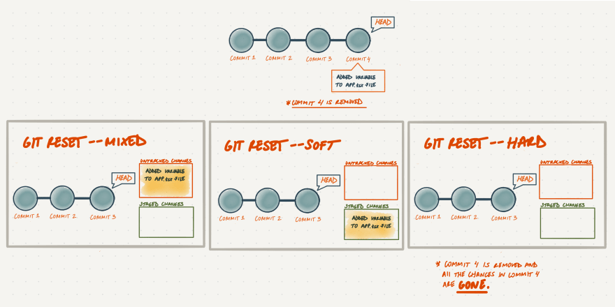
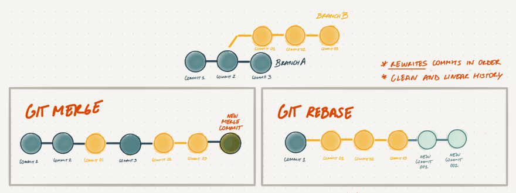

# Сравнение 5 команд Git: revert, checkout, reset, merge и rebase

Некоторые команды Git дают схожие результаты. Важно понимать разницу и применять правильные инструменты. Объясняем отличия между revert, checkout и reset, а также сравниваем merge и rebase.

# revert, checkout, reset

Команды `revert`, `checkout`, `reset` позволяют отменять изменения в репозитории и управлять ими. Поведение похожее, поэтому команды действительно легко спутать. Рассмотрим подробно каждую из них.

## git revert

Команда `git revert` – безопасный способ отменить операцию без потери истории коммитов. Команда отменяет действия прошлых [коммитов](https://proglib.io/p/git-commit), создавая новый, содержащий все отменённые изменения. Эта команда полезна, когда вы уже запушили изменения в удаленный репозиторий, так как она сохраняет нетронутым исходный коммит.

Откатиться с помощью commit-хэшей:

        `git revert [SHA]`

Можно и с помощью диапазонов:

        `git revert HEAD~[num-of-commits-back]`

Действие git revert

## git checkout

Универсальный инструмент `git checkout` позволяет переключаться между [ветками](https://proglib.io/p/vetvlenie-git-s-primerami-iz-realnoy-zhizni-2020-01-25), проверять старые коммиты и отменять локальные незакоммиченные изменения, переключая `HEAD` и изменяя рабочий каталог.

Для переключения между ветками:

        `git checkout [название ветки]`

Для проверки более старого коммита с помощью хэша:

        `git checkout [SHA]`

Чтобы проверить более старый коммит, используя диапазоны:

        `git checkout HEAD~[num-of-commits-back]`

Чтобы отменить все локальные незакоммиченные изменения:

        `git checkout`

Чтобы отменить определенное локальное незакоммиченное изменение:

        `git checkout -- [имя файла]`

Действие git checkout

## git reset

Команда `git reset` – это мощный способ отменить операцию. Существует три возможных аргумента:

**--mixed**

Значение по умолчанию. Команда `git reset --mixed` аналогична `git reset`. Вы переключите `HEAD` на последний коммит, и все изменения, добавленные после него, будут доступны в качестве неотслеживаемых (`untracked`) изменений в вашем рабочем каталоге.

**--soft**

HEAD переключается на последний коммит, однако, изменения, добавленные после этой фиксации, остаются с пометкой `staged`.

**--hard**

Используйте команду `git reset --hard` только тогда, когда вы знаете, что делаете. Вы переключите `HEAD` на последний коммит и уничтожите изменения, сделанные после него. Это действие не может быть отменено.

Действие git reset

Вы не должны использовать `git reset`, когда вы уже запушили данные на удаленный репозиторий. Удаление коммита другого члена команды нарушит его [рабочий процесс](https://proglib.io/p/effective-git-workflow).

Используйте `git reset -- [имя файла]`, чтобы отменить изменения в файле, который еще не был зафиксирован.

# merge vs rebase

Когда над проектом работает несколько человек, в какой-то момент нужно объединить код. Команды `rebase` и `merge` имеют разные подходы для консолидации изменений из одной ветви в другую.

Сравнение merge и rebase

## git merge

В `git merge` используется неразрушающая операция для объединения историй двух веток без их изменения. Команда создает новый `merge commit`. Это отличный способ консолидировать изменения, однако ваша история коммитов может получить несколько merge-коммитов в зависимости от того, насколько активна мастер-ветка.

Чтобы объединить последние изменения из master в вашу ветку:

        `git checkout [branch-name]  git merge master`

## git rebase

Команда `git rebase` перемещает историю всей ветки поверх другой, переписывая историю проекта новыми коммитами.

Команда полезна, если вы предпочитаете чистую и линейную историю проекта. Однако перестроить изменения, перенесенные в главную ветку удаленного репозитория небезопасно, т. к. вы будете изменять историю главной ветви, в то время как члены вашей команды будут продолжать работать над ней.

Кроме того, Git не позволит вам легко запушить пересобранный бранч на удаленный репозиторий. Вам придется заставить его это сделать при помощи `git push --force`, который перезаписывает удаленную ветку и может вызвать проблемы у других участников.

# Заключение

Git очень мощный инструмент, имеющий массу интересных и малоизвестных команд. В этой публикации мы рассмотрели команды, которые чаще всего вызывают бурю эмоций и комментариев на просторах сети. Внимательно изучите данные команды, и если что-то останется непонятным – обратитесь к [официальному хелпу](https://git-scm.com/doc).

## Источники

- https://proglib.io/p/sravnenie-5-komand-git-revert-checkout-reset-merge-i-rebase-2020-05-25
- [https://dev.to/milu_franz/git-explained-an-in-depth-comparison-18mk](https://dev.to/milu_franz/git-explained-an-in-depth-comparison-18mk)
