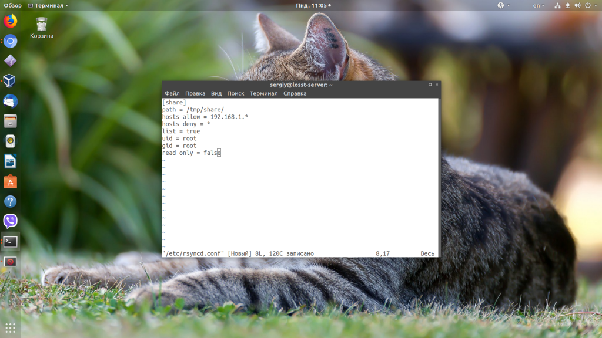
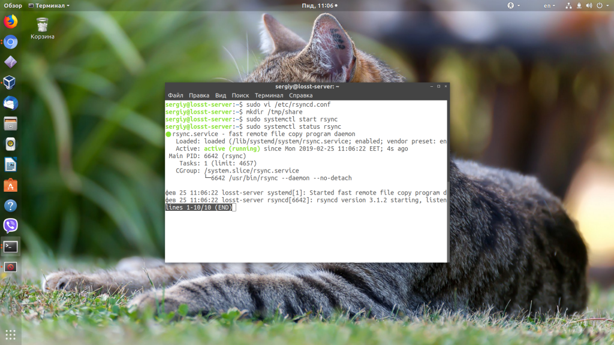
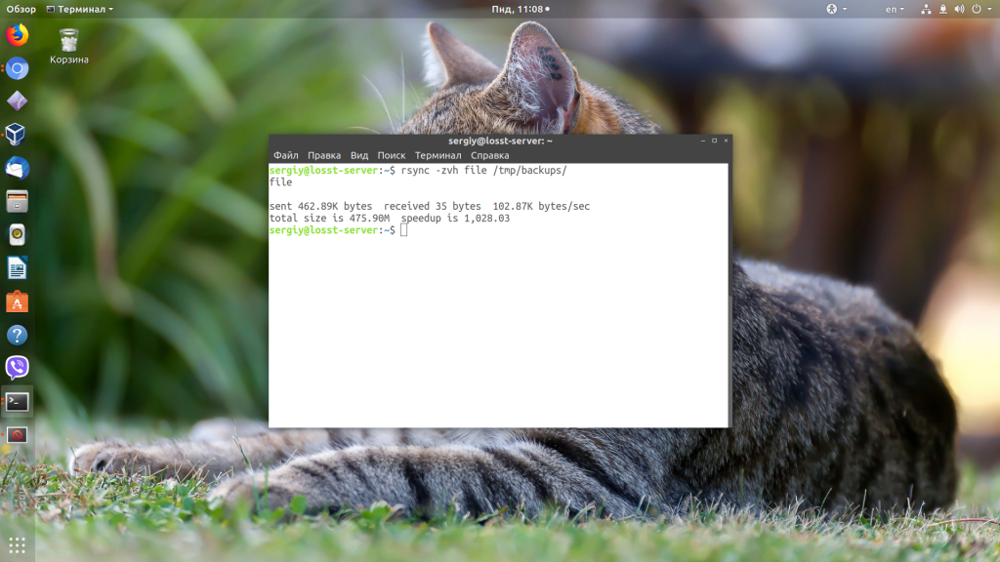
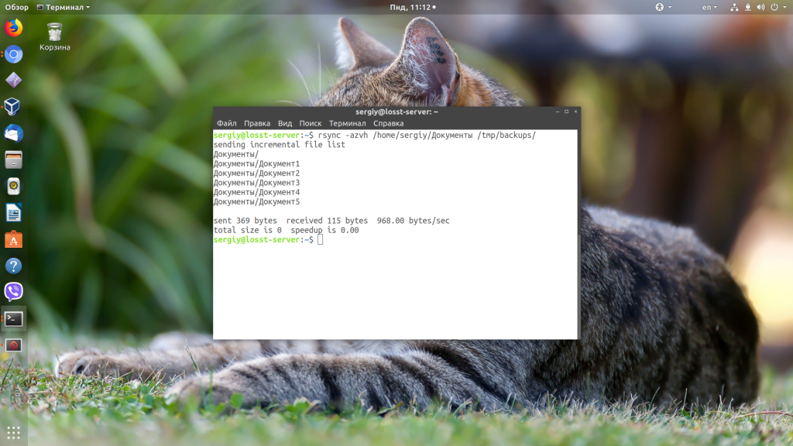
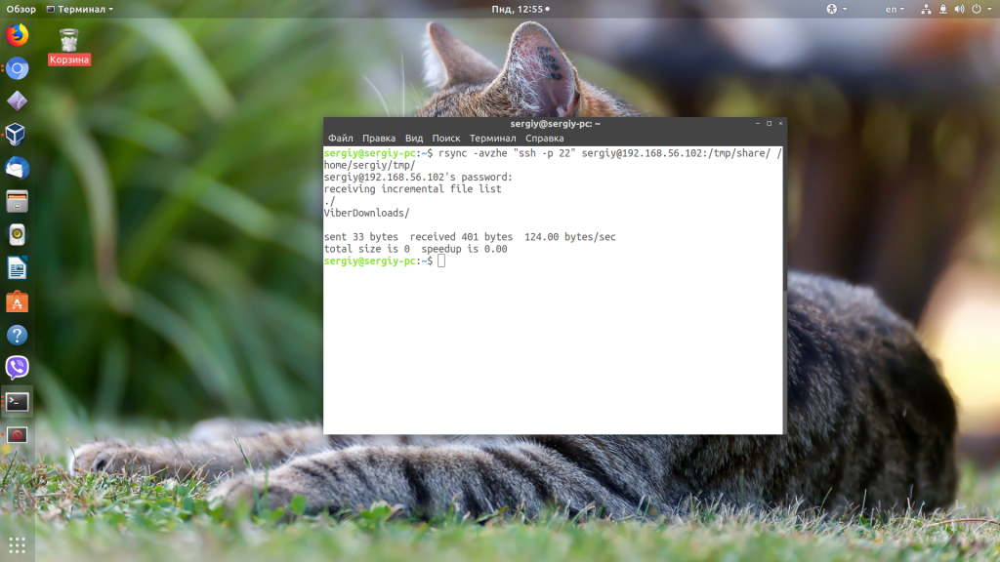

[Источник](https://losst.pro/rsync-primery-sinhronizatsii)

Потребность передачи файлов между серверами и компьютерами возникает довольно часто, особенно при администрировании нескольких устройств. Обычно для этих целей удобно использовать ssh и scp, но если файл очень большой, а изменена была только небольшая его часть, или вы хотите настроить постоянную автоматическую синхронизацию, то scp уже явно неидеальный вариант. Для этого существуют специальные утилиты. В этой статье мы рассмотрим одну из них. А именно будет рассмотрена rsync синхронизация в linux.

Rsync - это программное обеспечение с открытым исходным кодом, которое можно использовать для синхронизации файлов и папок с локального компьютера на удаленный и наоборот. Примечательная особенность Rsync - возможность передавать зашифрованные файлы с помощью SSH и SSL. Кроме того, здесь передача файлов выполняется в один поток, в отличие от других подобных программ, создающий отдельный поток для передачи каждого файла. Это увеличивает скорость и убирает дополнительные задержки, которые становятся проблемой при передаче большого количества маленьких файлов.

Возможно использование rsync для синхронизации файлов, каталогов, при этом может применяться сжатие и шифрование. Программа впервые была применена в июне 1996 года, она разработана Эндрю Тридгелом и Полом Маккерасом. Rsync синхронизация выполняется по протоколу RSYNC, который специально разработан не просто для передачи файлов между двумя компьютерами, а для их синхронизации. Если точнее, то передается не файл полностью, а только то, что было изменено.

Как вы уже поняли, в этой статье мы рассмотрим rsync примеры синхронизации, настройку rsync, а также ее основные возможности и опции.

## Особенности Rsync

Давайте сначала рассмотрим примечательные особенности Rsync:

- Возможность поддерживать синхронизацию целых деревьев каталогов;
- Можно сохранять символические ссылки, жесткие ссылки,  владельцев и права файла, метаданные и время создания;
- Не требует особых привилегий;
- Передача файлов одним потоком;
- Поддержка RSH, SSH в качестве транспорта;
- Поддержка анонимного Rsync.

## Синтаксис Rsync

Мы не будем подробно останавливаться на установке этой утилиты в системе. Она очень популярна, поэтому вы можете установить ее с помощью своего пакетного менеджера из официальных репозиториев. В Ubuntu команда установки будет выглядеть вот так:

`sudo apt-get install rsync`

А теперь, уже по традиции подобных статей, рассмотрим синтаксис команды rsync:

**$ rsync опции источник приемник**

В качестве источника и приемника может выступать удаленная или локальная директория. Например, ssh, rsync, samba сервер или локальная директория. Опции задают дополнительные параметры rsync.

## Опции Rsync

Теперь давайте кратко рассмотрим параметры rsync. Здесь перечислены не все опции. Для более подробной информации смотрите man rsync:

- **-v** - Выводить подробную информацию о процессе копирования;
- **-q** - Минимум информации;
- **-c** - Проверка контрольных сумм для файлов;
- **-a** - Режим архивирования, когда сохраняются все атрибуты оригинальных файлов;
- **-R** - Относительные пути;
- **-b** - Создание резервной копии;
- **-u** - Не перезаписывать более новые файлы;
- **-l** - Копировать символьные ссылки;
- **-L** - Копировать содержимое ссылок;
- **-H** - Копировать жесткие ссылки;
- **-p** - Сохранять права для файлов;
- **-g** - Сохранять группу;
- **-t** - Сохранять время модификации;
- **-x** - Работать только в этой файловой системе;
- **-e** - Использовать другой транспорт, например, ssh;
- **-z** - Сжимать файлы перед передачей;
- **--delete** - Удалять файлы которых нет в источнике;
- **--exclude** - Исключить файлы по шаблону;
- **--recursive** - Перебирать директории рекурсивно;
- **--no-recursive** - Отключить рекурсию;
- **--progress** - Выводить прогресс передачи файла;
- **--stat** - Показать статистику передачи;
- **--version** - Версия утилиты.

## Настройка сервера Rsync

Как вы понимаете, нельзя просто так взять и закинуть на первую попавшуюся машину файлы без установки на нее специального программного обеспечения. На удаленной машине должен быть установлен и настроен RSYNC, SSH, Samba или FTP сервер, с помощью которого Rsync сможет авторизоваться на машине и передавать туда файлы.

Рассмотрим минимальную настройку сервера rsync, для того чтобы могло быть выполнено копирование файлов rsync. Он позволит нам не только синхронизировать файлы на машину, но и получать их от туда.

Сначала создайте конфигурационный файл со следующим содержимым:

`sudo vi /etc/rsyncd.conf`

`pid file = /var/run/rsyncd.pid   lock file = /var/run/rsync.lock   log file = /var/log/rsync.log   [share]   path = /tmp/share/   hosts allow = 192.168.56.1   hosts deny = *   list = true   uid = root   gid = root   read only = false`

Здесь мы задаем путь к нашей папке для синхронизации, разрешаем доступ к серверу только с ip адреса (192.168.56.1) и запрещаем все остальные подключения. Параметры uid и gid указывают пользователя и группу, от которых будет запущен демон. Лучше не использовать root, а указать пользователя nobody и выдать ему права на ту папку, в которую будет выполняться синхронизация каталогов rsync.

Настройка rsync завершена, остается сохранить файл, запустить сервер rsync и добавить его в автозагрузку:

`sudo systemctl start rsync`

`sudo systemctl enable rsync`

Сервер будет предоставлять доступ к файлам без запроса пароля.

## Примеры синхронизации Rsync

Дальше давайте рассмотрим использование rsync, примеры синхронизации.

### 1. Копирование и синхронизация файлов на локальном компьютере

Rsync позволяет синхронизировать файлы и папки в пределах одной машины. Давайте сначала рассмотрим использование rsync для синхронизации файла на локальном компьютере:

`rsync -zvh file /tmp/backups/`

Указав опцию --progress вы можете видеть сколько процентов уже скопировано, а сколько еще осталось:

`rsync -zvh --progress file /tmp/backups/`

### 2. Синхронизация папок на локальной машине

Синхронизация папок rsync выполняется так же просто, как и файлов:

`rsync -zvh /home/user/documents /tmp/backups/`

Если вы хотите, чтобы все атрибуты файлов, такие, как дата изменения и создания сохранялись, необходимо использовать опцию -a:

`rsync -azvh /home/user/documents /tmp/backups/`

### 3. Синхронизация с удаленным сервером

Ненамного сложнее синхронизировать файлы с удаленным сервером. Скопируем локальную папку documents, на удаленный сервер:

`rsync -avz /home/sergiy/tmp/ root@192.168.56.102:/home/`

По умолчанию rsync попытается использовать транспорт ssh. Если вы хотите использовать ранее созданный сервер rsync, нужно указать это явно:

`rsync -avz /home/sergiy/tmp/ rsync://192.168.56.102:/share`

Точно также можно синхронизировать файлы с rsync из удаленного сервера:

`rsync -avz root@192.168.56.102:/home/ /home/sergiy/tmp/`

Адрес удаленного сервера записывается в таком формате:

**имя*пользователя@адрес*машины/папка/на/удаленной_машине**

Синхронизация папок rsync будет выполняться на стандартном порту.

### 4. Синхронизация файлов по SSH

Чтобы задать протокол подключения используется опция -e. При использовании SSH все передаваемые данные шифруются и передаются по защищенному каналу, таким образом, чтобы никто не мог их перехватить. Для использования SSH вам нужно знать пароль пользователя в системе.

Синхронизация файлов rsync с удаленного сервера по ssh будет выглядеть вот так:

`rsync -avzhe ssh root@192.168.56.102:/root/install.log /tmp/`

Если вы используете другой порт для ssh, то здесь его можно указать:

`rsync -avzhe "ssh -p 22" root@192.168.56.102:/root/install.log /tmp/`

А теперь передадим данные на тот же сервер:

`rsync -avzhe ssh backup.tar root@192.168.0.101:/backups/`

### 5. Просмотр прогресса при синхронизации

Для просмотра прогресса копирования файла с одной машины на другую используется опция progress:

`rsync -avzhe ssh --progress /home/user/documents root@192.168.56.102:/root/documents`

### 6. Синхронизация не всех файлов в rsync

Опции include и exclude позволяют указать какие файлы нужно синхронизировать, а какие исключить. Опции работают не только с файлами но и с директориями.

Например, скопируем все файлы, начинающиеся на букву R:

`rsync -avze ssh --include 'R*' --exclude '*' root@192.168.56.102:/root/documents/ /root/documents`

### 7. Удаление при синхронизации

Во время синхронизации можно удалять файлы, которых нет на машине откуда идет rsync синхронизация, для этого используется опция --delete.

Например:

`rsync -avz --delete root@192.168.56.102:/documents/ /tmp/documents/`

Если перед выполнением этой команды создать в папке файл которого нет на удаленном сервере, то он будет удален.

### 8. Максимальный размер файлов

Вы можете указать максимальный размер файлов, которые нужно синхронизировать. Для этого используется опция --max-size. Например, будем синхронизировать только файлы меньше 200 килобайт:

`rsync -avzhe ssh --max-size='200k' /user/documents/ root@192.168.56.102:/root/documents`

### 9. Удаление исходных файлов

Есть возможность удалять исходные файлы после завершения синхронизации с удаленным сервером:

`rsync --remove-source-files -zvh backup.tar /tmp/backups/`

Таким образом, файл backup.tar будет удален после завершения копирования в папку /tmp/backups.

### 10. Режим симуляции rsync

Если вы новичок, и еще не использовали rsync, то возможно захотите посмотреть как отработает команда без применения реальных действий в файловой системе. Для этого есть опция dry-run. Команда только выведет все выполняемые действия в терминал, без выполнения реальных изменений:

`rsync --dry-run --remove-source-files -zvh backup.tar /tmp/backups/`

### 11. Ограничить скорость передачи

Вы можете ограничить использование пропускной способности сети с помощью опции --bwlimit:

 `rsync --bwlimit=100 -avzhe ssh /user/home/documents/ root@192.168.56.102:/root/documents/`

Как я уже писал выше, rsync синхронизирует только части файла, если вы хотите синхронизировать файл целиком используйте опцию -W:

`rsync -zvhW backup.tar /tmp/backups/backup.tar   backup.tar`

### 12. Автоматическая синхронизация папок rsync

Можно расписать автоматическую синхронизацию с помощью cron. Но в случае доступа к серверу по SSH необходимо будет создать ключ и загрузить его на сервер, чтобы аутентификация проходила без запроса пароля.

Создаем ключи:

`ssh-keygen -t rsa`

Загружаем публичный ключ на сервер к с которым собираемся синхронизироваться:

`ssh-copy-id -i /home/sk/.ssh/id_rsa.pub sk@192.168.1.250`

Теперь можем переходить к настройке расписания cron. Будем запускать синхронизацию каждый день:

`crontab -e`

`00 05 * * * rsync -azvre ssh /home/user/Downloads/ 192.168.56.102:/share`

rsync синхронизация каталогов будет выполняться каждый день в пять утра. Подробнее о [настройке расписаний Cron](https://losst.pro/kak-dobavit-komandu-v-cron) можно почитать в отдельной статье.

## Выводы

Теперь вы знаете все что нужно, чтобы настройка rsync была выполнена правильно. Мы рассмотрели некоторые примеры rsync синхронизации. И теперь вы можете использовать все это для решения своих задач. Я упустил какую-то полезную информацию или у вас остались вопросы? Напишите в комментариях!
