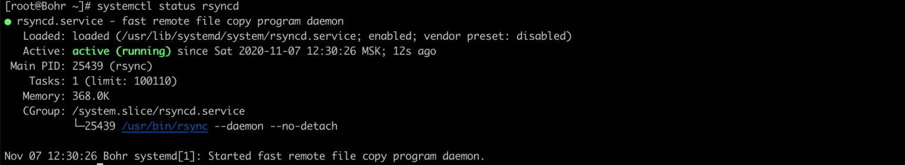

[Источник](https://selectel.ru/blog/rsync-guide/)

Ключевое преимущество утилиты — синхронизация структуры директорий целиком или файлов по-отдельности. Можно синхронизировать данные между узлами сети, сетевыми хранилищами, дисками и каталогами.

Rsync использует алгоритм сжатия данных Deflate c помощью модифицированной библиотеки zlib, поэтому пропускная способность каналов связи используется экономичнее в сравнении с утилитой SCP.

Вместе с файлами или каталогами, Rsync реплицирует также и разрешения на них. Вместе с этим, для работы не требуются права root, поэтому Rsync подойдет для целей резервного копирования и восстановления данных.

## Как установить, настроить и выполнить запуск Rsync на CentOS 8

Установка Rsync на Centos 8 выполняется из репозитория операционной системы, стандартным пакетным менеджером dnf:

`dnf -y install rsync rsync-daemon`

Эта команда установит саму утилиту rsync (клиентскую часть) и демон rsync (серверную часть). Серверная часть нужна для приема входящих обращений на синхронизацию через rsync без использования SSH. Позже покажем как обратиться к ней с внешнего сервера.

Перед началом работы необходимо выполнить настройку. Конфигурация выполняется в файле _/etc/rsyncd.conf_:

`vi /etc/rsyncd.conf`

`pid file = /var/run/rsyncd.pid lock file = /var/run/rsync.lock log file = /var/log/rsync.log [share] path = /tmp/share/ hosts allow = localhost 192.168.56.1 hosts deny = * list = true uid = nonroot gid = nonroot read only = false comment = Shared folder`

В файле конфигурации указываются следующие переменные:

- **pid file** — файл, в котором будет храниться номер процесса демона Rsync;
- **lock file** — файл блокировки для защиты от повторного запуска Rsync;
- **log file** — журнал сообщений, генерируемых демоном Rsync в процессе работы;
- **path** — путь до каталога, для которого выполняется синхронизация или копирование;
- **hosts allow** — хосты, которым явно разрешено подключаться к демону Rsync для передачи файлов;
- **hosts deny** — хосты, которым явно запрещено подключаться к демону Rsync для передачи файлов (в примере выше со всех, кроме разрешенных);
- **list** — флаг разрешения/запрета чтения каталога;
- **uid** — пользователь, от имени которого будет выполняться синхронизация для конкретного ресурса;
- **gid** — группа, от имени которой будет выполняться синхронизация для конкретного ресурса;
- **read only** — флаг для защиты имеющихся данных от изменения или удаления;
- **comment** — описание конфигурации.

Рекомендуем использовать для переменных uid и gid непривилегированные учетные записи.

Перед запуском утилиты, нужно также создать указанную в конфигурации директорию:

```
mkdir /tmp/share
```

На этом настройка Rsync в Linux завершена и можно запускать утилиту:

```
systemctl enable --now rsyncd
```

Теперь выполним настройки безопасности. Чтобы Rsync работал корректно, важно настроить SELinux и сетевой экран:

      `setsebool -P rsync_full_access on`

      `firewall-cmd --add-service=rsyncd --permanent`

      `firewall-cmd --add-service=rsyncd --permanent`

Проверим статус сервиса _rsyncd_:



## Синтаксис Rsync

В этом разделе мы приведем основные параметры, с которыми выполняется Rsync. Синтаксис в общем виде выглядит так:

```
rsync -options <source> <destination>
```

**-options** — параметры, с которыми должна выполняться утилита.

**<source>**— каталог или файл, который является источником.

**<destination>** — каталог или файл, который является приемником.

Ниже приведены основные параметры, с которыми вызывается Rsync:

**-v, –verbose** — для отображения отладочной информации в процессе синхронизации.

**-q, –quiet** — для запрета вывода об ошибках.

**-c, –checksum** — для сравнения файлов по контрольной сумме, вместо даты/времени изменения или размера.

**-a, –archive** — включение сжатия данных.

**-r, –recursive** — для включения режима рекурсивного копирования директорий.

**-b, –backup** — для активации режима режима резервного копирования, чтобы создавались резервные копии оригинальных файлов при обновлении.

**–backup-dir=<каталог>** — каталог, в котором будут храниться резервные копии.

**–suffix=SUFFIX** — суффикс для файлов, сохраняемых в режиме резервного копирования..

**-u, –update** — для пропуска обновления файлов с более поздней датой изменения.

**-l, –links** — для сохранения символических ссылок.

**-H, –hard-links** — для сохранения жестких ссылок.

**-p, –perms** — для сохранения разрешений объекта файла или каталога.

**-E, –executability** — для сохранения прав на исполнение.

**–chmod=<права>** — для изменения прав доступа на конкретные объекты (файлы или каталоги).

**-o, –owner** — для сохранения владельца объекта.

**-g, –group** — для сохранения группы владельца.

**-S, –sparse** — для выполнения дефрагментации одновременно с копированием данных.

**-n, –dry-run** — для тестирования без копирования;

**-W, –whole-file** — для копирования файлов целиком, по умолчанию копируется только часть с изменениями.

**–delete** — для удаления старых файлов, если их уже нет в источнике копирования.

**–delete-before** — для удаления файлов в папке назначения до начала синхронизации.

**–max-delete=<количество файлов>** — для ограничения максимального числа удаляемых файлов.

**–max-size=<размер файлов>** — для ограничения максимального размера передаваемых файлов.

**–min-size=<размер файлов>** — для ограничения минимального размера передаваемых файлов.

**-z, –compress** — для включения сжатия файлов во время передачи.

**–compress-level=<число>** — для установки уровня сжатия от 0 до 9.

**–exclude=<имена файлов>** — для исключения из синхронизации файлов.

**–exclude-from=<имя файла>** — для исключения из синхронизации файлов, указанных в файле.

**–include=<имена файлов>** — для включения в синхронизацию файлов.

**–include-from=<имя файла>** — для включения в синхронизацию файлов, указанных в файле.

**–port=<порт>** — для установки сетевого порта для подключения на удаленном узле.

**–progress** — для включения строки прогресса при синхронизации.

**–log-file=<файл>** — для указания места расположения лог-файла.

**–password-file=<файл>** — При аутентификации пароль можно хранить в специальном файле. Это необходимо для автоматизации выполнения команды без пароля.

**–list-only** — для отображения имен файлов без копирования.

**–bwlimit=<число>** — для ограничения скорости передачи в Кбит/c.

**-4, –ipv4** — приоритет использования IPv4.

**-6, –ipv6** — приоритет использования IPv6.

**–version** — для вывода версии Rsync.

Теперь разберем частные случаи работы Rsync, для которых может потребоваться ввод дополнительных параметров.

### Копирование и синхронизация файлов с rsync (локально и удаленно)

При локальном режиме работы достаточно задать каталог/файл-источник и каталог/файл-приемник:

```
rsync -avzhHl /path/of/source/folder /path/to/destination/folder
```

Если копирование нужно выполнить с удаленным узлом, добавляется имя пользователя и IP-адрес или имя узла:

```
rsync -avzhHl /path/of/source/folder root@192.168.56.1:/path/to/destination/folder
```

Для корректной работы с удаленным узлами необходимо настроить доступ по ключам. Rsync этот метода подключения также поддерживает. Об использовании ключей для подключения к серверу мы рассказывали [в предыдущей статье](https://selectel.ru/blog/ssh-ubuntu-setup/).

### Синхронизация по SSH и Rsync-демон

По умолчанию синхронизация выполняется по протоколу SSH (cм. примеры выше), дополнительные параметры для этого указывать не требуется. Чтобы обращаться напрямую к Rsync, минуя SSH, на сервере-приемнике должен быть запущен демон Rsync. В предыдущем разделе мы как раз уже это сделали, поэтому можем обратиться с удаленного сервера:

[Что такое и для чего нужен протокол SSH](https://selectel.ru/blog/what-is-ssh/)

```
rsync -avz /tmp/share rsync://192.168.56.101:/tmp/share
```

### Автоматическая синхронизация папок

Автоматическая синхронизация папок выполняется штатным способом — планировщиком заданий (cron). Планировщиком удобнее выполнять скрипт, так будет упрощается управление конфигурацией синхронизации. Создадим скрипт:

```
vi rsync_to_cron.sh
```

`!/bin/sh  RSYNC=/usr/bin/rsync  SSH=/usr/bin/ssh  KEY=/root/.ssh/id_rsa RUSER=root RHOST=192.168.56.1  RPATH=/remote/dir LPATH=/local/dir  $RSYNC -az -e "$SSH -i $KEY" $RUSER@$RHOST:$RPATH $LPATH`

Далее создадим задание в планировщике:

```
crontab -e
0 22 * * * /root/scripts/rsync_to_cron.sh
```

### Просмотр прогресса синхронизации

Для просмотра прогресса синхронизации, вместе с запуском утилиты необходимо использовать ключ _–progress_:

```
rsync -avzhHl --progress /path/of/source/folder root@192.168.56.1:/path/to/destination/folder
```

### Удаление при синхронизации

В процессе синхронизации можно удалять файлы на сервере-приемнике, которых уже нет на сервере-источнике. Для этого используется опция _–delete_:

```
rsync -avzhHl --delete /path/of/source/folder root@192.168.56.1:/path/to/destination/folder
```

### Ограничение максимального размера и скорости передачи

Rsync также имеет встроенную возможность ограничения максимального размера синхронизируемого файла. Для этого нужно использовать опцию _–max-size_:

```
rsync -avzhHl --max-size=’100M’ /path/of/source/folder root@192.168.56.1:/path/to/destination/folder
```

Для ограничения скорости передачи предназначена опция _–bwlimit_ (значение указывается в Кбит/с):

```
rsync -avzhHl --bwlimit=’100’ /path/of/source/folder root@192.168.56.1:/path/to/destination/folder
```

### Опции include и exclude

Специальные опции _–include_ и _–exclude_ позволяют включать или исключать из синхронизации файлы с определенными именами:

```
rsync -avzhHl --include='.txt' --exclude='' /path/of/source/folder root@192.168.56.1:/path/to/destination/folder
```

Есть возможность перечислить включаемые или исключаемые имена в файле, для этого используются опции _–include-from_ и _–exclude-from_ соответственно:

```
rsync -avzhHl --include-from='/root/rsync_include.conf' --exclude='/root/rsync_exclude.conf' /path/of/source/folder root@192.168.56.1:/path/to/destination/folder
```
