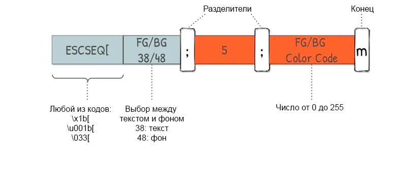

> [!NOTE] 
> Файл, о котором будет идти речь в данной заметке уже существует в данном репозитории по пути `my-bash/.dircolors`. Его требуется только скопировать в домашнюю директорию пользователя.

Из документации к ls, выяснил, что установка цветов для вывода осуществляется при помощи утилиты **dircolors**, которая либо устанавливает параметры цвета из своей собственной базы, либо берет их из файла `~/.dircolors`. Такого файла в моем домашнем каталоге не было. 

Также упоминалось, что инициализация использования цветов происходит через `~/.bashrc`, файл с настройками командной оболочки, а сами параметры определяются через переменную LC_COLORS.

Действительно, в `~/.bashrc` обнаружился скрипт следующего содержания:


<mark>Его суть сводится к проверке на наличие утилиты dircolors в системе, </mark>присваивания значения переменной и, при удачном выполнении, использовании параметра --color=auto при каждом вызове ls.
Если запустить утилиту dircolors, она выводит значение переменной LC_COLOR.


Также возможен вывод значения переменной LC_COLORS в структурированном виде, указанием ключа: `dircolors -p` - тот же вывод только в один столбец.

**Если перенаправить вывод `dircolors -p > ~/.dircolors`, то будет создан структурированный файл, из которого и будут браться настройки цветов. ** Редактируя данный файл и устанавливаются настройки цвета для вывода ls.

В созданном файле .dircolors есть подсказка:


Устанавливая последовательность через точку с запятой и получаем нужный нам цвет в консоли linux, согласно перечисленным. 

Цвета терминала linux от 30 до 37 для цвета шрифта, а с 40 до 47 для фона. К примеру:

DIR 01;34 подразумевает, что имена директорий будут выделяться жирным шрифтом и синим цветом.

<u>Некоторые терминалы поддерживают вывод  256 цветов.</u> 
Если команда `echo $TERM` выводит `xterm-256color`, то ваш терминал всё корректно обработает.

Чтобы не перебирать цвета linux вручную, можно вывести их в консоли, воспользовавшись скриптами.
Заливка фона.
```bash
for i in {0..255}; do printf '\e[48;5;%dm%3d ' $i $i; (((i+3) % 18)) || printf '\e[0m\n'; done
```
Выкрашивается только текст.
```bash
for i in {0..255}; do printf '\e[38;5;%dm%3d ' $i $i; (((i+3) % 18)) || printf '\e[0m\n'; done
```
или *<u>более удобный вариант</u>* - выбирать цвета с сайта [terminal-color-builder](http://terminal-color-builder.mudasobwa.ru/)

Подставляя в значение цвета **38;5;x - где x цвет из таблицы** (полученные при выполнении скриптов выше или сайта), получаем необходимый результат.

Формат цвета продемонстрирован на картинке.

Для нашего файла мы будем использовать более простой формат :
- если нужен только текст, то `38;5;125`
- если нужен еще и фон, то `38;05;222;48;05;22`
- можно еще использовать модификаторы `01;38;05;222;48;05;22` (в нашем случае мы выделяем текст жирным) см. подсказку в файле `00=none 01=bold 04=underscore 05=blink 07=reverse 08=concealed` и это не все модификаторы. Полный список представлен на картинке ниже.

Источники:
- https://losst.pro/tsveta-terminala-linux
- https://habr.com/ru/companies/macloud/articles/558316/