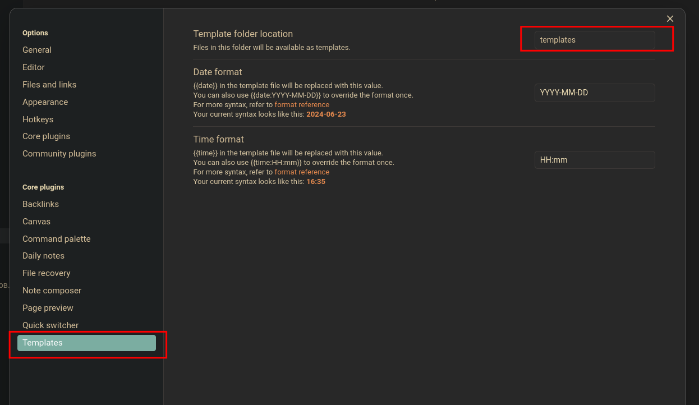
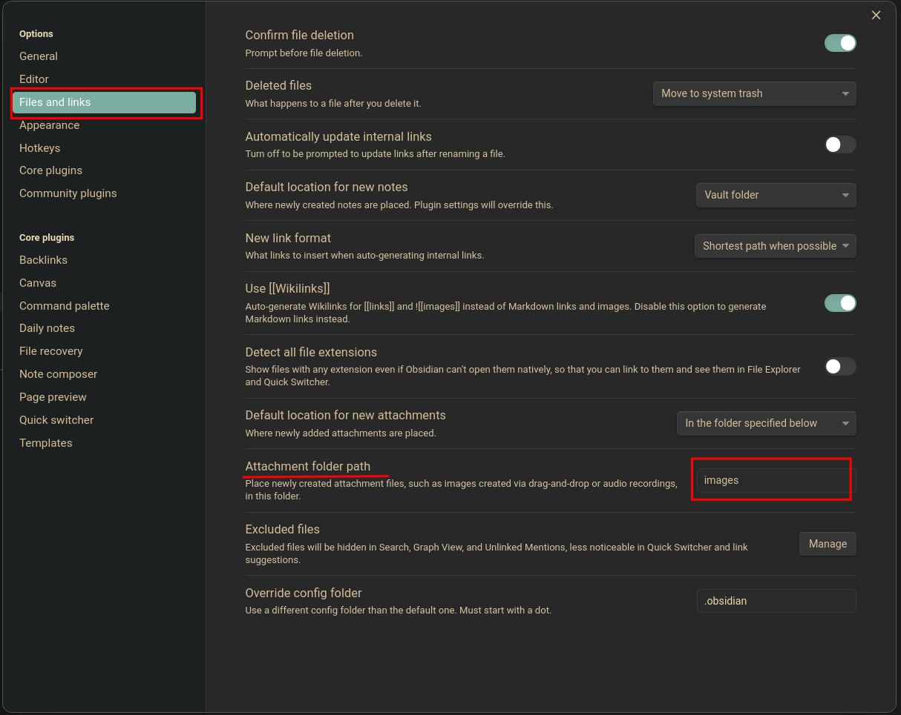

1. Тема оформления - **Material gruvbox**
2. Плагины
	- **Excalidraw** - плагин для создания схем и майнд карт
	- **Advanced Table** - плагин для упрощенной работы с таблицами

3. Необходимо также задать папку в которой лежат пользовательские шаблоны (указываю свою папку, находящуюся в данной репозитории)
4. Необходимо указать путь к сохраняемым картинкам т.е эта папка в которую будут автоматически помещаться изображения, которые мы перетащим в заметку.