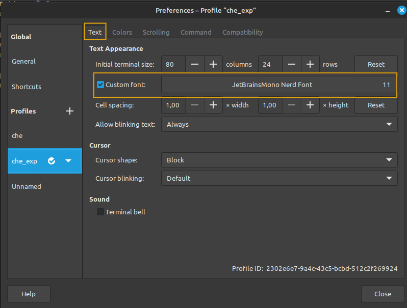

1. Переходим на [сайт](https://www.nerdfonts.com/font-downloads) и скачиваем понравившийся шрифт (JetBrainsMono Nerd Font)  
2. распаковать архив в каталог (создать если такого каталога нет)
`~/.local/share/fonts/`
3. В настройках терминала выбираем скаченный шрифт (см. рис. ниже)
	
	4.  Необходимо установить `Node.js` смотри [заметку]( obsidian://open?vault=notes&file=linux%2F%D0%A3%D0%BF%D1%80%D0%B0%D0%B2%D0%BB%D0%B5%D0%BD%D0%B8%D0%B5%20%D0%B2%D0%B5%D1%80%D1%81%D0%B8%D1%8F%D0%BC%D0%B8%20Node.js%20%D0%B8%20NPM%20%D1%81%20%D0%BF%D0%BE%D0%BC%D0%BE%D1%89%D1%8C%D1%8E%20NVM)
	5. Необходимо установить `lua` смотри [заметку](obsidian://open?vault=notes&file=lua%2F%D0%A3%D1%81%D1%82%D0%B0%D0%BD%D0%BE%D0%B2%D0%BA%D0%B0%20lua%20%D0%B2%20linux)
	6. Необходимо установить `cmake` (потребуется при установке плагинов через Masson)
	```bash		
	sudo apt-get -y install cmake
	```