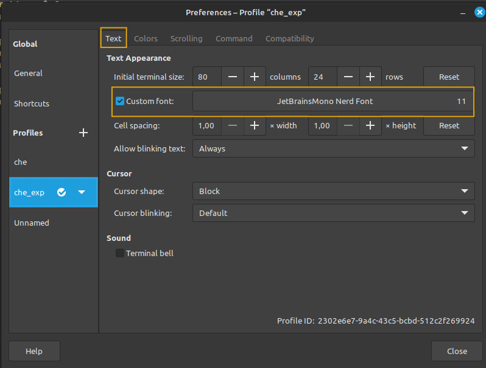

1. Переходим на [сайт](https://www.nerdfonts.com/font-downloads) и скачиваем понравившийся шрифт (JetBrainsMono Nerd Font)  
2. распаковать архив в каталог (создать если такого каталога нет)
`~/.local/share/fonts/`
3. В настройках терминала выбираем скаченный шрифт (см. рис. ниже)
	