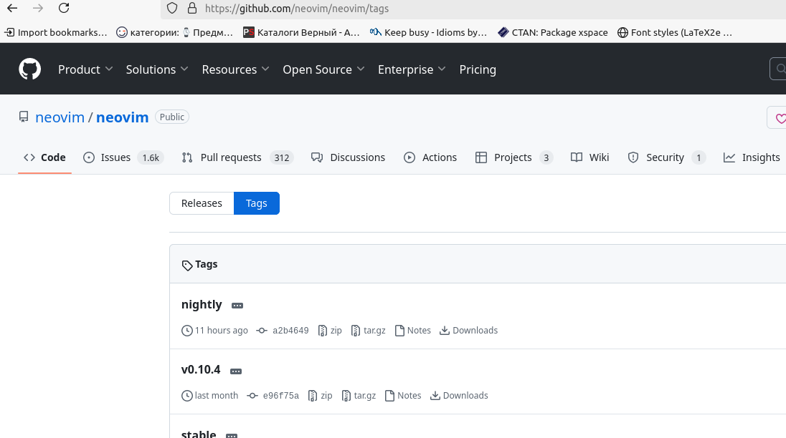

1. Скачиваем собранный neovim с [сайта](https://github.com/neovim/neovim/releases) , нажав на кнопку Tag (см. рис) 
2. Переходим в таб Releases и смотрим секцию **Linux (x86_64)**.
3. Даем права на исполнение для скаченного файла (**nvim-linux-arm64.appimage**). Можем переименовать файл для краткости.
```bash
chmod u+x nvim-linux-x86_64.appimage
```
4. Делаем алиас на наш скаченный файл в файле `~/.bashrc`
`alias nvim='~/nvim-linux-arm64.appimage'`
